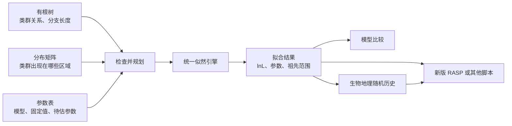
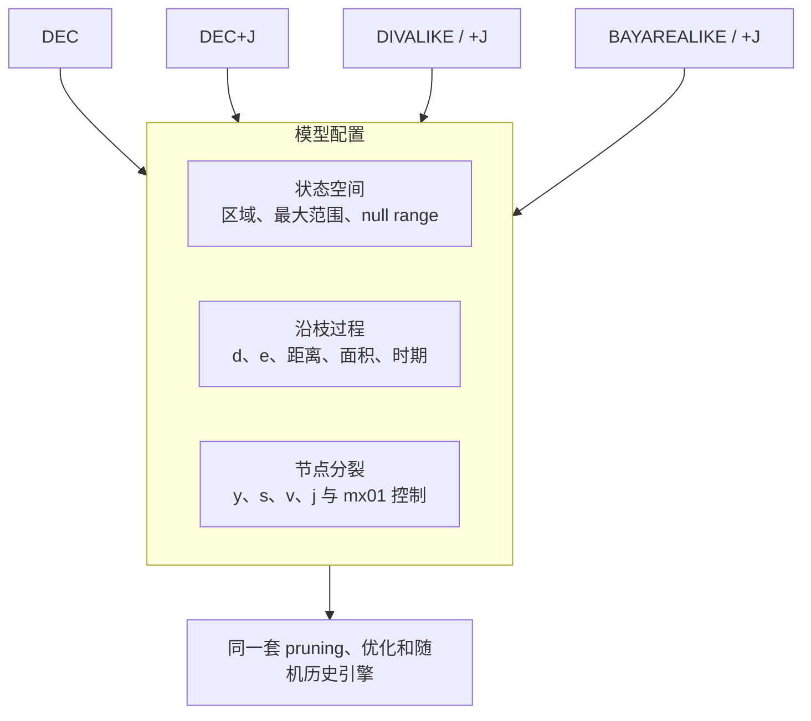
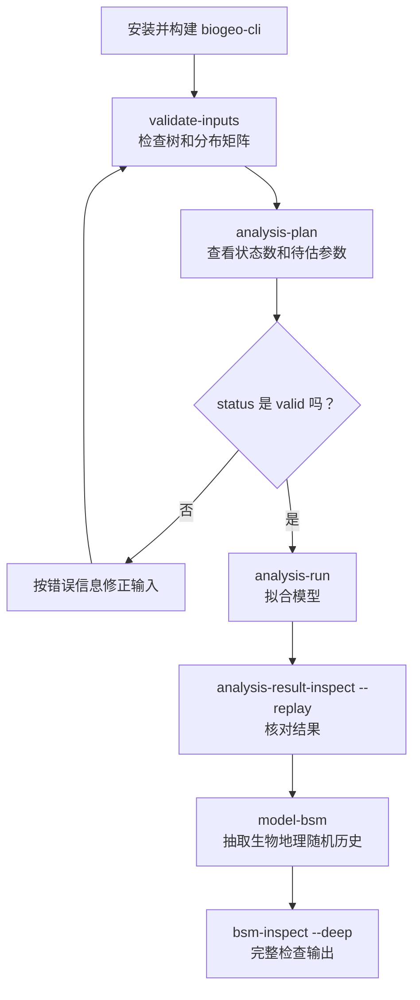

# biogeo-rs

`biogeo-rs` 是一个用 Rust 编写的历史生物地理命令行项目，可执行程序名为
`biogeo-cli`。它用同一套可配置的似然引擎运行 DEC、DEC+J、DIVALIKE、
DIVALIKE+J、BAYAREALIKE 和 BAYAREALIKE+J，也可以作为新版 RASP 的计算后端。

当前版本是 `0.1.0` 公开科研发布候选版。64 位 Windows 已经过完整测试；Linux、服务器和
调度系统仍待系统验证。项目仍在开发中，不应把“已实现核心分析”理解为已经逐函数重写了
BioGeoBEARS 的全部 R 端外围功能。

## 它做什么

一次最基本的分析需要三类输入：

1. 一棵有分支长度的有根树；
2. 每个末端类群出现在哪些区域；
3. 一个模型参数表，例如 DEC 的默认参数配置。

程序先检查输入和预计状态数，再估计模型参数、计算祖先范围与节点分裂概率。拟合完成后，
还可以比较多个模型，或抽取大量可能的生物地理随机历史。



六个模型不是六套互不相干的程序。它们共享状态空间、沿枝演化、节点分裂、树上似然、参数
优化和随机历史引擎，只是启用了不同的参数与分裂规则。



## 目前支持什么

- 六个 BioGeoBEARS-like preset，共用统一的状态空间、沿枝过程和节点分裂引擎；
- 23 行参数表，可固定或释放参数、设置边界、联动参数，并进行多起点优化；
- 时间分层、扩散和局部灭绝倍率、距离、环境距离、面积、邻接和允许范围约束；
- 祖先范围概率、节点分裂情景、AIC/AICc、模型平均和似然比检验；
- 可重复的并行生物地理随机历史，支持流式写出、分片、检查点和中断后继续；
- Newick/NEXUS、古老末端、直接祖先、随机化石放置和常见范围矩阵转换；
- 自包含、可重放的版本化分析结果，便于命令行、批处理脚本和新版 RASP 读取。

更细的已实现项、验证证据和未完成边界见
[BioGeoBEARS 功能对照](docs/biogeobears-parity-matrix.md)与
[v0.1 版本范围](docs/v0.1-release-notes.md)。

## 安装

当前 GitHub Releases 尚未提供预编译 EXE，推荐从源码构建。第一次接触 Rust 时，请直接按
[完整 Windows 安装教程](docs/installation.md)操作，里面包含逐步说明、打包安装、升级、
卸载和常见错误。

已经装好 Rust 的用户可在 PowerShell 中运行：

```powershell
git clone https://github.com/Yxu-bio/biogeo-rs.git
cd biogeo-rs
cargo build --release --locked -p biogeo-cli

.\target\release\biogeo-cli.exe --version
.\target\release\biogeo-cli.exe engine-info
```

正式分析应使用 `--release` 构建。第一次构建需要联网下载 Rust 依赖。Windows 需要 stable
MSVC Rust 工具链和 Microsoft C++ 构建工具。构建后的程序位于：

```text
target\release\biogeo-cli.exe
```

## 十分钟跑通第一个分析

下面使用仓库自带的两末端、两区域示例。这个小例子不是科学结论，只用于让新用户先看清完整
流程，并快速发现安装或输入问题。



### 1. 看懂示例输入

示例树是：

```text
(A:1,B:1);
```

它表示 A 和 B 是一对末端类群，两条枝的长度都是 1。分布矩阵是制表符分隔的 TSV：

```text
tip    AreaA    AreaB
A      1        0
B      0        1
```

`1` 表示该类群出现在该区域，`0` 表示不出现。

### 2. 单独检查树和范围矩阵

```powershell
.\target\release\biogeo-cli.exe validate-inputs `
  --tree examples\analysis_request\tree.nwk `
  --ranges examples\analysis_request\ranges.tsv
```

这一步检查树能否读取、类群名能否一一对应、分支长度和范围编码是否合法。它不计算似然，也
不会修改输入文件。

### 3. 预先查看任务规模

```powershell
.\target\release\biogeo-cli.exe analysis-plan `
  --request examples\analysis_request\analysis.tsv
```

重点查看这些字段：

| 字段 | 通俗含义 |
|---|---|
| `status` | `valid` 表示请求和输入已通过规划检查 |
| `tips` | 树的末端类群数 |
| `areas` | 区域数 |
| `state_count_estimate` / `states` | 预计和实际允许的范围状态数 |
| `free_parameter_count` / `free_parameters` | 待估参数数量和名称 |
| `risk_level` | 当前状态空间的资源风险提示 |
| `warnings` | 可以运行但值得用户检查的事项 |

先运行 `analysis-plan` 很重要，因为区域数和最大范围大小会组合出大量状态。若有 `A` 个区域，
最大范围大小为 `K`，不包含 null range 时：

```text
states = C(A,1) + C(A,2) + ... + C(A,K)
```

例如 7 个区域、最大范围大小 5 会产生 119 个状态；若包含 null range 则为 120 个。状态数
比末端数更容易成为计算和内存瓶颈。

### 4. 拟合 DEC 模型

```powershell
.\target\release\biogeo-cli.exe analysis-run `
  --request examples\analysis_request\analysis.tsv `
  --output-dir output\tutorial-dec
```

这个示例会估计 DEC 的 `d` 和 `e`。这里的“参数优化”不是随意调整参数，而是反复试算不同
参数值，寻找使观测树和范围数据的似然最大的组合。

输出目录不会覆盖已有目录。再次运行时请使用新的名称，例如 `output\tutorial-dec-2`。这一规则
用于避免误删科研结果。

### 5. 核对结果

```powershell
.\target\release\biogeo-cli.exe analysis-result-inspect `
  --analysis-result output\tutorial-dec `
  --replay
```

`--replay` 会从结果目录内保存的树、范围数据和最终参数重新计算 lnL。如果文件缺失、被修改，
或模型身份不一致，检查会失败。

结果目录的主要内容是：

```text
tutorial-dec/
  metadata.tsv
  source-parameters.tsv
  resolved-parameters.tsv
  inputs.tsv
  input-bundle/
```

- `metadata.tsv`：lnL、模型、状态空间和优化诊断；
- `source-parameters.tsv`：用户提交的 fixed、free 和 derived 声明；
- `resolved-parameters.tsv`：拟合结束后的全部参数值；
- `input-bundle`：可移动的输入副本和文件清单。

不要只看 lnL 数字的绝对大小。只有使用相同数据、相同状态空间和可比较似然定义的模型，才能
进一步比较 lnL 或 AIC。`optimization_converged=true` 表示优化器满足了停止条件，但仍不等于
模型在生物学上一定合理。

### 6. 抽取生物地理随机历史

```powershell
.\target\release\biogeo-cli.exe model-bsm `
  --analysis-result output\tutorial-dec `
  --bsm-samples 100 `
  --bsm-output-dir output\tutorial-dec-bsm `
  --bsm-output-level compact `
  --bsm-threads auto `
  --bsm-shard-samples 50 `
  --seed 1
```

这会在已经拟合的模型条件下抽取 100 条可能的历史，包括沿枝扩张和局部灭绝、节点分裂类型、
各状态占据时间等。它们是对历史不确定性的样本，不是 100 次重新优化，也不是 100 个确定答案。

`--bsm-threads auto` 使用当前进程可用的并行度，并受样本数限制，不会把 16 写成固定上限。
相同模型、seed 和样本编号的结果不随线程数改变。

完整检查输出：

```powershell
.\target\release\biogeo-cli.exe bsm-inspect `
  --bsm-result output\tutorial-dec-bsm `
  --deep
```

`--deep` 会扫描全部表，检查样本数、事件链、占据时间、时期约束和分片关系。100 条适合确认
流程；正式统计需要根据研究问题、分布稳定性和计算预算选择更多重复样本。

## 使用自己的数据

### 1. 生成一个可编辑任务目录

```powershell
.\target\release\biogeo-cli.exe analysis-template `
  --preset dec `
  --mode optimize `
  --output-dir my-dec-analysis
```

程序会生成 `analysis.tsv` 和 `parameters.tsv`。把自己的 `tree.nwk` 与 `ranges.tsv` 放入该
目录，再运行：

```powershell
.\target\release\biogeo-cli.exe analysis-plan `
  --request my-dec-analysis\analysis.tsv
```

模板在缺少数据时会明确显示尚未就绪，而不会静默开始分析。

### 2. 树文件要求

- 支持有根 Newick 和 NEXUS；
- 树末端名称必须与范围矩阵第一列对应；
- 支持带引号和空格的标签、NEXUS `TRANSLATE` 与显式多树选择；
- 非根分支缺少长度时默认拒绝，可由用户显式指定填充值；
- 古老末端、直接祖先和随机化石放置有专门输入规则。

详见[树、化石末端与直接祖先](docs/tree-input-and-fossil-tips.md)和
[随机化石放置](docs/random-fossil-placement.md)。

### 3. 范围矩阵要求

推荐使用 TSV：

```text
tip    AreaA    AreaB    AreaC
Species_1    1    0    1
Species_2    0    1    0
```

也可以直接读取支持的 BioGeoBEARS/LAGRANGE `.data` 和 CSV 范围矩阵。需要先转换和检查时：

```powershell
.\target\release\biogeo-cli.exe convert-ranges `
  --ranges input.data
```

`?` 可以在显式启用 ambiguity 模式后表示范围不确定性。检测次数、对照次数以及
`mf/dp/fdp` 检测模型使用另一套输入格式，见[检测模型](docs/detection-model.md)。

### 4. 调整最大范围大小

`max_range_size` 决定祖先最多可以同时占据多少个区域。它是生物学假设，也直接决定状态数。
不要只为了让程序更快就随意降低，也不要在没有生物学依据时默认允许所有区域组合。先用
`analysis-plan` 查看状态数和资源风险，再决定设置。

## 选择和比较模型

| preset | 主要差别 | 常见用途 |
|---|---|---|
| `DEC` | d/e 沿枝变化与 DEC 分裂规则 | DEC 基线 |
| `DEC+J` | DEC 基础上释放 founder-event `j` | 检查跳跃扩散的支持 |
| `DIVALIKE` | 节点分裂更强调 DIVA-like vicariance | DIVA-like 对照 |
| `DIVALIKE+J` | DIVALIKE 加 `j` | 带 founder-event 的 DIVA-like 对照 |
| `BAYAREALIKE` | 更强调 range-copying 与沿枝变化 | BayArea-like 对照 |
| `BAYAREALIKE+J` | BAYAREALIKE 加 `j` | 带 founder-event 的 BayArea-like 对照 |

仓库示例会拟合 DEC 和 DEC+J，计算 AIC，并从明确选择的 DEC 结果抽取 4 条 summary 随机历史：

```powershell
.\target\release\biogeo-cli.exe model-workflow-plan `
  --request examples\model_workflow\workflow.tsv

.\target\release\biogeo-cli.exe model-workflow `
  --request examples\model_workflow\workflow.tsv `
  --output-dir output\tutorial-models
```

模型比较表位于：

```text
output\tutorial-models\model-batch\comparison.tsv
```

AIC 只适合比较基于同一数据、状态空间和似然口径拟合的候选模型。嵌套模型可进一步进行
likelihood-ratio test，但边界参数会影响常规卡方近似，程序会报告关系与适用性，而不是把所有
模型对都强行当成有效 LRT。

## 一条命令运行完整流程

熟悉前面的分步命令后，可使用可恢复工作流一次完成规划、拟合、随机历史和检查：

```powershell
.\target\release\biogeo-cli.exe analysis-workflow `
  --request examples\analysis_request\analysis.tsv `
  --output-dir output\complete-workflow `
  --bsm-samples 100 `
  --bsm-output-level compact `
  --bsm-threads auto `
  --deep
```

大型任务中断后，对同一请求和同一输出目录追加 `--resume`。程序只复用经过校验的已完成部分，
不会覆盖不同配置的旧任务。

## 生物地理随机历史输出级别

| 级别 | 保存具体路径 | 占据表 | 建议用途 |
|---|---:|---|---|
| `legacy` | 是 | 稠密 | 兼容已有读取脚本 |
| `full` | 是 | 稠密 | 人工检查和完整归档 |
| `compact` | 是 | 稀疏 | 新版 RASP 和大型常规任务 |
| `summary` | 否 | 稀疏 | 只比较事件与占据时间分布的大量重复样本 |

大量样本建议使用 `compact` 或 `summary`，并设置 `--bsm-shard-samples` 与定期 checkpoint。
详细字段见[生物地理随机历史输出格式](docs/bsm-output-formats.md)。

## 时间分层和空间修饰

`examples/stratified_analysis` 提供基于 BioGeoBEARS 官方 Psychotria 案例整理的五时期示例。
程序支持：

- 各时期的扩散与局部灭绝倍率；
- 距离指数 `x`、环境距离指数 `n`、面积指数 `u`；
- 区域邻接和每个时期允许的范围；
- 静态输入与分时期输入的组合；
- 参数表中的 fixed、free 和 derived 参数。

开始修改参数表前，先阅读[参数表教程](docs/parameter-table.md)和
[分析请求格式](docs/analysis-request.md)。这些参数会真实进入 Q 矩阵、节点分裂或范围约束，
不是仅用于结果展示。

## 常用命令索引

```text
--help                     查看所有命令
engine-info                查看引擎与格式能力
analysis-template          新建分析模板
validate-inputs            检查树和范围数据
analysis-plan              预检统一分析请求
analysis-run               运行一次统一分析
analysis-result-inspect    检查并重放拟合结果
model-bsm                  从拟合结果抽取随机历史
bsm-inspect                检查随机历史结果
analysis-workflow          完成单模型全流程
model-workflow             拟合、比较和汇总多个模型
convert-tree               转换树输入
convert-ranges             转换范围矩阵
fossil-place               按约束随机放置化石
```

查看某个命令的精确参数：

```powershell
.\target\release\biogeo-cli.exe analysis-run --help
.\target\release\biogeo-cli.exe model-bsm --help
```

## Windows 发布包

需要给另一台 Windows PC 或新版 RASP 提供固定程序目录时：

```powershell
powershell -NoProfile -ExecutionPolicy Bypass `
  -File packaging\build-windows-package.ps1
```

`dist` 中会生成 ZIP 和 SHA-256，包内包含 EXE、许可证、schema、示例、文档和文件清单。
未签名的公开科研包可以正常构建和安装，不需要代码签名证书。安装方法见
[完整安装教程](docs/installation.md#可选制作并安装-windows-发布包)。

## 科学验证与性能

BioGeoBEARS 1.1.3 作为 BioGeoBEARS-like 模型语义和数值 golden；LAGRANGE-ng 作为独立
LAGRANGE 语义与性能参考。随机历史通过大量独立样本比较事件数量、事件类型、时期占比和状态
占据时间的分布，不要求两个程序在相同 seed 下逐条产生相同路径。

公开验证包括小型精确 fixture、复杂时间分层 fixture、六 preset、参数优化、祖先概率、模型
比较、随机历史分布以及 1534-tip、7-area Ponerinae 数据的真实规模检查。性能数字依赖树、
状态数、模型、输出级别、线程和机器，不能用单个倍率代表所有任务。

验证方法和现有结果见 [validation/README.md](validation/README.md) 与
[性能基准](docs/performance-benchmark.md)。

开发者可运行：

```powershell
cargo test --workspace --locked
cargo clippy --workspace --all-targets --locked -- -D warnings
powershell -NoProfile -ExecutionPolicy Bypass `
  -File validation\check-public-cli-examples.ps1 `
  -SkipBuild
```

## 文档导航

### 新手首先阅读

- [完整安装教程](docs/installation.md)
- [BioGeoBEARS 中文入门](docs/biogeobears-chinese-tutorial.md)
- [分析请求格式](docs/analysis-request.md)
- [参数表](docs/parameter-table.md)
- [分析结果目录](docs/analysis-result.md)
- [生物地理随机历史输出](docs/bsm-output-formats.md)

### 数据和高级分析

- [输入检查](docs/input-validation.md)
- [旧范围数据导入](docs/legacy-input-import.md)
- [不确定范围](docs/ambiguous-ranges.md)
- [树、化石末端与直接祖先](docs/tree-input-and-fossil-tips.md)
- [随机化石放置](docs/random-fossil-placement.md)
- [多模型工作流](docs/model-workflow.md)
- [模型平均](docs/model-average.md)
- [批量数据集](docs/dataset-batch.md)

### 开发、验证与接入

- [框架架构](docs/framework-architecture.md)
- [新版 RASP CLI 接入](docs/rasp-cli-integration.md)
- [BioGeoBEARS 功能对照](docs/biogeobears-parity-matrix.md)
- [v0.1 版本范围](docs/v0.1-release-notes.md)
- [Windows 发布与安装](docs/windows-release.md)
- [源码与许可证审计](docs/source-and-license-audit.md)

## 与 BioGeoBEARS 和 LAGRANGE-ng 的关系

本项目是独立的 Rust 实现，不是 BioGeoBEARS 的 R 包装层，也不要求已有 BioGeoBEARS R 脚本
原样运行。BioGeoBEARS 用于统一模型语义和结果对照；LAGRANGE-ng 保持独立参考身份。开发目标
是提供清晰、可验证、高性能的命令行引擎，而不是复制 BioGeoBEARS 的绘图界面或全部 R 辅助函数。

## 许可证

整个项目采用 [GNU General Public License v3.0 or later](LICENSE)，即
`GPL-3.0-or-later`。可以使用、研究、修改和再分发；再分发本项目或修改版本时，需要继续遵守
GPL 并提供相应源代码和许可证说明。

第三方依赖与验证数据来源见 [THIRD-PARTY-NOTICES.md](THIRD-PARTY-NOTICES.md) 和
[LICENSE-STATUS.md](LICENSE-STATUS.md)。
