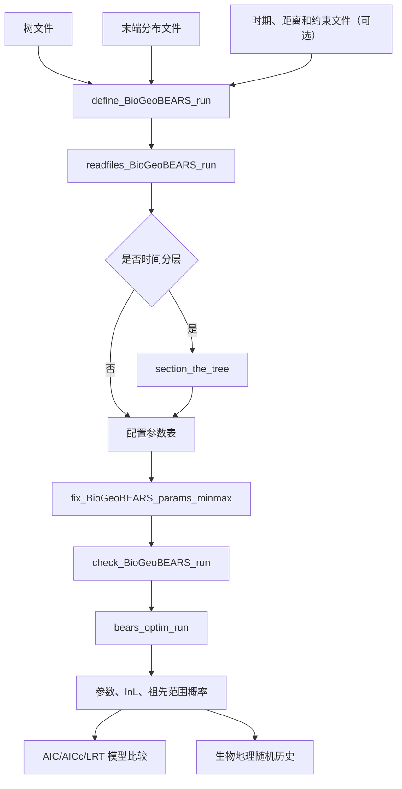

# BioGeoBEARS 中文教程：从工作流到统一似然框架

> 适用版本：本项目保存的 BioGeoBEARS 1.1.3 源码，以及包内 `Phylowiki_M0_2023_v1.R`、`Phylowiki_M3_2023_v1.R` 官方示例。
>
> 本文把 Biogeographic Stochastic Mapping 统一译作“生物地理随机历史”。它不是在画地理地图，而是在已拟合模型下抽样一条可能的地理演化历史。

如果你想直接学习 biogeo-rs 命令行操作，请先阅读 [biogeo-rs 命令行完整教程](cli-tutorial.md)；本文主要解释 BioGeoBEARS 的模型背景、术语和 R 端参考流程。

## 1. 阅读目标

读完本文后，应该能够回答以下问题：

1. BioGeoBEARS 输入什么、计算什么、输出什么？
2. DEC、DEC+J、DIVALIKE 和 BAYAREALIKE 为什么可以共用一个引擎？
3. `d`、`e`、`j`、`y`、`s`、`v` 和 `mx01*` 分别控制什么？
4. 参数优化、似然值和祖先范围概率是怎样得到的？
5. 如何完成普通分析、时间分层分析、模型比较和生物地理随机历史抽样？
6. 化石、检测不完全、多棵树、距离和区域约束分别进入工作流的什么位置？
7. 阅读源码时，哪些函数属于主流程，哪些只是底层工具或实验功能？

BioGeoBEARS 1.1.3 的 `R/` 目录中有 500 多个函数定义。学习它不需要逐个背函数。日常分析的主干只有十几个函数，其余函数围绕输入处理、矩阵构造、树遍历、绘图、模拟和兼容旧格式展开。

## 2. 五分钟理解 BioGeoBEARS

### 2.1 它要回答的问题

给定：

- 一棵有枝长的系统发育树；
- 每个现生或化石末端出现在哪些区域；
- 一套允许的地理范围及演化规则；

BioGeoBEARS 主要回答：

- 哪组演化速率最能解释末端分布？
- 每个祖先节点可能位于哪些区域组合？
- 哪种模型对数据的解释相对更好？
- 在拟合好的模型下，可能发生过多少次扩散、局部消失、隔离分化或跳跃扩散？

### 2.2 “区域”和“范围状态”不是一回事

假设有三个区域 `A`、`B`、`C`：

- 区域是 `A`、`B`、`C`；
- 范围状态可以是 `A`、`B`、`C`、`AB`、`AC`、`BC`、`ABC`；
- 如果允许空范围，还会有 `_`，表示不占据任何区域。

若区域数为 `A`，最大范围大小为 `m`，默认状态数为：

```text
sum(C(A, k), k = 1..m) + 是否包含空范围
```

例如 7 个区域且 `max_range_size = 5`：

```text
C(7,1) + C(7,2) + C(7,3) + C(7,4) + C(7,5) + 1 = 120
```

状态数通常比末端数更容易造成性能爆炸。每条分支都要在这些状态之间传播概率，核心计算还涉及状态转移矩阵。

可直接检查：

```r
numstates_from_numareas(
  numareas = 7,
  maxareas = 5,
  include_null_range = TRUE
)
```

### 2.3 一条分支和一个分叉点使用不同规则

BioGeoBEARS 把过程拆成两部分。

**沿分支发生的变化，anagenesis：**

- `d`：范围扩张，例如 `A -> AB`；
- `e`：局部消失，例如 `AB -> A`；
- 这些速率组成连续时间马尔可夫过程的 `Q` 矩阵。

**在物种分化节点发生的范围继承，cladogenesis：**

- `y`：祖先范围复制给两个后代；
- `s`：一个后代继承祖先范围，另一个继承其子集；
- `v`：祖先范围被两个后代分开继承；
- `j`：一个后代跳到祖先范围以外的区域，即 founder-event/jump dispersal。

不同命名模型不是六套完全独立的算法。它们使用相同的状态空间、`Q` 矩阵生成、节点情景生成、树上似然计算和优化过程，只是打开、关闭或重新加权不同事件。

### 2.4 BioGeoBEARS 实际计算了什么

枝长为 `t` 时，沿枝状态转移概率来自：

```text
P(t) = exp(Q * t)
```

在节点处，程序枚举“祖先范围 -> 左后代范围 + 右后代范围”的允许情景，并按 `y/s/v/j` 和 `mx01*` 分配权重。

然后执行树上剪枝计算：

1. 每个末端先变成一个状态似然向量。
2. 从末端向根传播每条分支的概率。
3. 在每个节点合并两个后代的条件似然。
4. 在根部结合根状态权重，得到整棵树的似然。
5. 为避免数值下溢，中间向量会缩放，最终报告自然对数似然 `lnL`。

`lnL` 越大越好。因为概率通常小于 1，`lnL` 往往是负数，所以 `-100` 比 `-120` 更好。

### 2.5 参数优化的通俗解释

`d` 和 `e` 不是程序预先知道的常数。程序会尝试许多组合：

```text
d=0.01, e=0.01 -> lnL=-120
d=0.04, e=0.02 -> lnL=-103
d=0.08, e=0.30 -> lnL=-118
```

使 `lnL` 最大的组合就是最大似然估计。优化器只是负责更聪明地寻找这个组合。它不改变数据，也不是为了和另一个软件“硬对齐”。两个实现若模型语义和数值算法一致，应在同一数据上得到接近的最优参数和 `lnL`。

## 3. 完整工作流总览



最重要的对象有三个：

| 对象 | 常见变量名 | 作用 |
|---|---|---|
| 运行配置 | `BioGeoBEARS_run_object` | 文件路径、状态空间、优化器、模型参数和运行选项 |
| 模型参数对象 | `BioGeoBEARS_model_object` | S4 对象，核心是 `@params_table` |
| 结果对象 | `res`、`resDEC` | 输入快照、最优参数、优化器结果、似然和祖先概率 |

## 4. 安装与版本固定

官方仓库建议从 GitHub 安装。为了让分析可复现，至少记录 R、BioGeoBEARS、`rexpokit`、`cladoRcpp`、`optimx` 和 `GenSA` 的版本。

```r
install.packages(c(
  "devtools", "ape", "optimx", "GenSA",
  "rexpokit", "cladoRcpp", "snow", "MultinomialCI"
))

devtools::install_github("nmatzke/BioGeoBEARS")
```

加载主流程所需包：

```r
library(ape)
library(optimx)
library(GenSA)
library(rexpokit)
library(cladoRcpp)
library(parallel)
library(BioGeoBEARS)

packageVersion("BioGeoBEARS")
sessionInfo()
```

项目开发和正式分析应使用独立 R 库或 `renv`，不要让一次升级悄悄改变旧结果。

需要注意，包名虽然含有 Bayesian，但 1.1.3 的说明明确表示基于 `LaplacesDemon` 的贝叶斯分析目前不属于正式维护的安装范围。现实中的标准工作流是最大似然分析。

## 5. 输入数据

### 5.1 树文件

主流程使用 Newick 树。BioGeoBEARS 1.1.3 的检查要求通常包括：

- 树已经定根；
- 树是严格二叉树；
- 枝长存在且大于 0；
- 末端名称唯一；
- 末端名称与分布文件完全一致；
- BGB 1.1.3 不接受名称中的空格和单引号，建议使用下划线；
- 枝长最好是有明确意义的时间单位；
- 非超度量树中没有到达现在的末端会被解释为化石末端。

基本检查：

```r
tr <- read.tree("tree.newick")

is.rooted(tr)
is.binary(tr)
anyDuplicated(tr$tip.label)
range(tr$edge.length)
plot(tr)
axisPhylo()
```

不要在不理解原因时把极短枝统一改大。`min_branchlength` 以下的侧枝会被 BGB 当作“从祖先谱系直接采到的化石”，而不是一次正常物种分化。

### 5.2 末端分布文件

BioGeoBEARS 传统上使用 LAGRANGE/PHYLIP 风格的 `.data` 文件：

```text
4 3 (A B C)
taxon_1 100
taxon_2 110
taxon_3 001
taxon_4 101
```

含义：

- 第一行 `4` 是末端数；
- `3` 是区域数；
- `(A B C)` 给出区域名称及顺序；
- `110` 表示该末端占据 `A` 和 `B`；
- 物种名和 0/1 字符串之间使用空白或制表符；
- 0/1 字符串内部不能有空格。

读取和检查：

```r
tipranges <- getranges_from_LagrangePHYLIP("geog.data")
tipranges

areas <- getareas_from_tipranges_object(tipranges)
max_observed_range <- max(rowSums(dfnums_to_numeric(tipranges@df)))
```

如果后续要运行生物地理随机历史，BGB 的旧实现要求每个区域使用单字符代码，例如 `A` 到 `G`。普通似然分析没有这个字符串解析限制。

### 5.3 `max_range_size`

`max_range_size` 是允许一个谱系同时占据的最大区域数。它必须至少覆盖观测到的最大末端范围。

它不是纯粹的性能参数。把它从 5 改为 2，会删除所有三区域及以上范围，因此也改变了模型假设。

### 5.4 空范围

```r
BioGeoBEARS_run_object$include_null_range <- TRUE
```

- `TRUE`：状态空间包含空范围；
- `FALSE`：对应常被称为 DEC* 一类的非空范围模型；
- 这个设置会改变状态编号、`Q` 矩阵和模型概率，不能只在输出阶段切换。

## 6. 跑通一个最小 DEC 分析

下面的脚本只保留命令行分析所需内容，不包含绘图。

```r
library(ape)
library(optimx)
library(rexpokit)
library(cladoRcpp)
library(BioGeoBEARS)

trfn <- normalizePath("tree.newick")
geogfn <- normalizePath("geog.data")

tipranges <- getranges_from_LagrangePHYLIP(geogfn)
max_observed_range <- max(rowSums(dfnums_to_numeric(tipranges@df)))

run <- define_BioGeoBEARS_run()
run$trfn <- trfn
run$geogfn <- geogfn
run$max_range_size <- max_observed_range
run$include_null_range <- TRUE
run$min_branchlength <- 1e-6

run$on_NaN_error <- -1e50
run$speedup <- TRUE
run$use_optimx <- TRUE
run$num_cores_to_use <- 1
run$force_sparse <- FALSE

run$return_condlikes_table <- TRUE
run$calc_TTL_loglike_from_condlikes_table <- TRUE
run$calc_ancprobs <- TRUE

run <- readfiles_BioGeoBEARS_run(run)
run <- fix_BioGeoBEARS_params_minmax(BioGeoBEARS_run_object = run)
check_BioGeoBEARS_run(run)

# define_BioGeoBEARS_run() 的默认模型就是 DEC
resDEC <- bears_optim_run(run)
save(resDEC, file = "resDEC.Rdata")
```

这几个步骤不能随意省略：

1. `define_BioGeoBEARS_run()` 创建完整默认配置和 DEC 参数表。
2. `readfiles_BioGeoBEARS_run()` 真正读取时期、距离和约束等附加文件。
3. `fix_BioGeoBEARS_params_minmax()` 修正落在上下界之外的起始值。
4. `check_BioGeoBEARS_run()` 检查树、分布、区域顺序、状态数和参数边界。
5. `bears_optim_run()` 执行参数搜索，并在最优参数下重新计算祖先概率。

## 7. 参数表是统一模型框架的核心

查看参数表：

```r
run$BioGeoBEARS_model_object@params_table
```

每一列的含义：

| 列 | 含义 |
|---|---|
| `type` | `free` 表示优化，`fixed` 表示固定，其他字符串表示由公式联动 |
| `init` | 优化起点 |
| `min` | 下界 |
| `max` | 上界 |
| `est` | 当前值或最终估计值 |
| `note` | 源码维护备注，不等同于稳定性承诺 |
| `desc` | 参数说明 |

### 7.1 主参数

| 参数 | 模块 | 直观含义 | 默认状态 |
|---|---|---|---|
| `d` | 沿枝 | 增加一个区域的基础速率 | free |
| `e` | 沿枝 | 丢失一个区域的基础速率 | free |
| `a` | 沿枝 | 标准字符式的范围切换速率 | fixed 0 |
| `b` | 沿枝 | 枝长指数 | fixed 1，仅非分层 |
| `x` | 修饰 | 地理距离指数，使用 `distance^x` | fixed 0 |
| `n` | 修饰 | 环境距离指数 | fixed 0 |
| `w` | 修饰 | 手工扩散倍率的指数 | fixed 1 |
| `u` | 修饰 | 区域面积对局部消失的指数 | fixed 0 |
| `j` | 节点 | 跳跃扩散的相对单事件权重 | fixed 0 |
| `y` | 节点 | 范围复制权重 | 联动 |
| `s` | 节点 | 子集继承权重 | 联动 |
| `v` | 节点 | 隔离分割权重 | 联动 |
| `mx01*` | 节点 | 控制较小后代范围大小的最大熵参数 | 固定或联动 |
| `mf` | 检测 | 目标类群在样本中的平均频率 | fixed |
| `dp` | 检测 | 真正存在时被检测到的概率 | fixed |
| `fdp` | 检测 | 实际不存在时的误检概率 | fixed |

`ysv` 和 `ys` 是联动参数，用来表达 `y+s+v` 与 `y+s` 的关系。默认 DEC 中可看到类似：

```text
ysv = 3 - j
ys  = ysv * 2/3
y   = ysv * 1/3
s   = ysv * 1/3
v   = ysv * 1/3
```

它们不是额外的独立生物学速率，而是参数表内部的组合关系。

### 7.2 释放、固定和联动参数

释放一个参数：

```r
p <- run$BioGeoBEARS_model_object@params_table
p["j", "type"] <- "free"
p["j", "init"] <- 0.01
p["j", "est"] <- 0.01
run$BioGeoBEARS_model_object@params_table <- p
```

固定一个参数：

```r
p["e", "type"] <- "fixed"
p["e", "init"] <- 0
p["e", "est"] <- 0
```

联动参数：

```r
p["ysv", "type"] <- "2-j"
p["y", "type"] <- "ysv*1/2"
p["v", "type"] <- "ysv*1/2"
```

修改后应再次执行：

```r
run <- fix_BioGeoBEARS_params_minmax(BioGeoBEARS_run_object = run)
check_BioGeoBEARS_run(run)
```

不要因为参数表允许操作，就一次释放所有参数。参数可计算不代表数据能把它们分别识别出来。应使用多个起点、检查边界解，并比较重复优化结果。

### 7.3 `mx01*` 应怎样理解

`mx01j`、`mx01y`、`mx01s`、`mx01v` 分别控制对应节点事件中“较小后代范围”的大小分布。

- 接近 `0`：强烈偏向最小范围，通常是单区域；
- 约 `0.5`：允许更广泛的分割大小；
- 接近 `1`：偏向较大的较小后代范围；
- 它不是“事件发生概率”，而是事件已经选定后，对后代范围大小的再分配。

## 8. 六个标准 preset

### 8.1 DEC

默认 `define_BioGeoBEARS_run()` 已经是 DEC：

- `d/e` 自由；
- `j=0`；
- `y/s/v` 按 DEC 规则联动；
- 默认 `mx01*` 强烈偏向至少一个后代为单区域。

### 8.2 DEC+J

在 DEC 上释放 `j`：

```r
p <- run$BioGeoBEARS_model_object@params_table
p["j", "type"] <- "free"
p["j", "init"] <- 0.0001
p["j", "est"] <- 0.0001
run$BioGeoBEARS_model_object@params_table <- p
```

官方脚本先使用 DEC 的最优 `d/e` 作为 DEC+J 起点。这保证扩展模型至少从一个已知的合理位置开始，但仍应检查最终收敛。

### 8.3 DIVALIKE

```r
p <- run$BioGeoBEARS_model_object@params_table

p["s", "type"] <- "fixed"
p["s", c("init", "est")] <- 0

p["ysv", "type"] <- "2-j"
p["ys", "type"] <- "ysv*1/2"
p["y", "type"] <- "ysv*1/2"
p["v", "type"] <- "ysv*1/2"

p["mx01v", "type"] <- "fixed"
p["mx01v", c("init", "est")] <- 0.5

run$BioGeoBEARS_model_object@params_table <- p
```

关键变化是关闭 `s`，保留范围复制和更广泛的隔离分割。

### 8.4 DIVALIKE+J

在 DIVALIKE 上释放 `j`，并把 `j` 的上界设为约 2：

```r
p["j", "type"] <- "free"
p["j", c("init", "est")] <- 0.0001
p["j", "min"] <- 0.00001
p["j", "max"] <- 1.99999
```

### 8.5 BAYAREALIKE

```r
p <- run$BioGeoBEARS_model_object@params_table

p["s", "type"] <- "fixed"
p["s", c("init", "est")] <- 0
p["v", "type"] <- "fixed"
p["v", c("init", "est")] <- 0

p["ysv", "type"] <- "1-j"
p["ys", "type"] <- "ysv*1/1"
p["y", "type"] <- "1-j"

p["mx01y", "type"] <- "fixed"
p["mx01y", c("init", "est")] <- 0.9999

run$BioGeoBEARS_model_object@params_table <- p
```

节点处只保留精确的范围复制，不允许 `s` 和 `v`。

### 8.6 BAYAREALIKE+J

在 BAYAREALIKE 上释放 `j`，并把上界设为约 1：

```r
p["j", "type"] <- "free"
p["j", c("init", "est")] <- 0.0001
p["j", "min"] <- 0.00001
p["j", "max"] <- 0.99999
```

### 8.7 preset 对照

| preset | 沿枝 `d/e` | `y` | `s` | `v` | `j` |
|---|---:|---:|---:|---:|---:|
| DEC | free/free | 开 | 开 | 开 | 0 |
| DEC+J | free/free | 开 | 开 | 开 | free |
| DIVALIKE | free/free | 开 | 关 | 开，允许更广分割 | 0 |
| DIVALIKE+J | free/free | 开 | 关 | 开，允许更广分割 | free |
| BAYAREALIKE | free/free | 仅精确复制 | 关 | 关 | 0 |
| BAYAREALIKE+J | free/free | 仅精确复制 | 关 | 关 | free |

这里的“开/关”是简化表达。真正进入节点概率的是每个祖先范围下所有允许情景的权重归一化结果。

## 9. 优化器与收敛

BioGeoBEARS 1.1.3 的常见选项：

```r
run$use_optimx <- TRUE       # optimx + bobyqa
run$use_optimx <- FALSE      # stats::optim + L-BFGS-B
run$use_optimx <- "GenSA"   # 广义模拟退火
```

官方 2023 脚本的经验建议是：

- 两三个参数时通常先用 `optimx/bobyqa`；
- 五个以上参数可考虑 `GenSA`，但更慢且简单问题上也可能失败；
- `speedup=TRUE` 会使用较宽松的迭代和容差设置；
- 复杂模型应重复使用不同起点，并用更严格设置复核最好结果。

建议最少做四项检查：

1. 优化器是否报告正常结束；
2. 最优参数是否卡在 `min` 或 `max`；
3. 不同起点是否回到接近的 `lnL`；
4. 扩展模型是否至少达到其嵌套简化模型的 `lnL`。

`on_NaN_error = -1e50` 的含义是：某组参数导致数值失败时，给它一个极差的分数，让优化器离开该区域。它不能把真正的模型错误变成有效结果，仍需检查失败是否频繁出现。

## 10. 结果对象怎样读

常用字段：

```r
names(resDEC)

resDEC$total_loglikelihood
get_LnL_from_BioGeoBEARS_results_object(resDEC)

resDEC$inputs
resDEC$outputs@params_table
resDEC$optim_result
```

主要祖先概率矩阵：

```r
resDEC$ML_marginal_prob_each_state_at_branch_top_AT_node
resDEC$ML_marginal_prob_each_state_at_branch_bottom_below_node
```

直观区别：

- `branch_top_AT_node`：节点位置的祖先范围概率；
- `branch_bottom_below_node`：节点分化之后、进入后代分支底部的范围概率；
- 两者之间由节点分裂情景连接，因此不必相同。

结果中还保存了：

- 向根传播的条件似然；
- 从根向末端传播的概率；
- 每个节点是否完成计算；
- 根部分布；
- 完整运行配置和优化器原始输出。

祖先概率不是“某个范围被证明为真”的概率。它是在树、末端数据、模型结构和最优参数都给定之后的条件结果。更换模型或状态空间，概率也会变化。

## 11. 模型比较

### 11.1 AIC 与 AICc

```r
restable <- rbind(
  DEC = extract_params_from_BioGeoBEARS_results_object(
    resDEC, returnwhat = "table", addl_params = "j"
  ),
  DECj = extract_params_from_BioGeoBEARS_results_object(
    resDECj, returnwhat = "table", addl_params = "j"
  )
)

aic <- calc_AIC_column(restable$LnL, restable$numparams)
restable_aic <- cbind(restable, aic)
AkaikeWeights_on_summary_table(restable_aic, colname_to_use = "AIC")

aicc <- calc_AICc_column(
  restable$LnL,
  restable$numparams,
  samplesize = length(read.tree(trfn)$tip.label)
)
```

AIC 的核心思想是同时考虑拟合程度和自由参数数量。不能只选 `lnL` 最大的模型，因为增加参数通常不会降低最优 `lnL`。

### 11.2 LRT

只有嵌套模型才能直接做似然比检验，例如同一 preset 的非 `+J` 与 `+J` 版本。DEC、DIVALIKE 和 BAYAREALIKE 相互之间不是嵌套关系，不能因为都在 BioGeoBEARS 中就直接做 LRT。

```r
LnL_alt <- get_LnL_from_BioGeoBEARS_results_object(resDECj)
LnL_null <- get_LnL_from_BioGeoBEARS_results_object(resDEC)

AICstats_2models(
  LnL_1 = LnL_alt,
  LnL_2 = LnL_null,
  numparams1 = 3,
  numparams2 = 2
)
```

### 11.3 `+J` 的方法争论

DEC 与 DEC+J 的比较存在公开方法争论。Ree 与 Sanmartin 2018 认为该比较存在概念和统计问题；Matzke 2022 反驳说它们等价于两个 ClaSSE 子模型的比较，因此统计比较有效。

实际报告时应：

- 明确列出所有候选模型和参数数目；
- 不把 AIC 权重写成“模型为真的概率”；
- 同时报告参数是否在边界；
- 说明 `+J` 争论，而不是把单一软件默认做法写成无争议定论；
- 结合模型充分性、生物学假设和敏感性分析解释结果。

## 12. 时间分层分析

### 12.1 它解决什么问题

普通分析假定整棵树历史中的地理规则不变。时间分层允许不同年代使用不同的：

- 扩散倍率；
- 区域距离；
- 区域面积；
- 可用区域或允许范围；
- 区域邻接关系。

程序会在时期边界切开跨越边界的分支，每一段使用对应时期的状态空间和转移矩阵。

### 12.2 时期边界

`timeperiods.txt` 每行一个距今年龄，例如：

```text
0.5
1.9
3.7
5.1
10
```

它定义从现在向过去的多个区间。最后一个值应覆盖树根年龄。

### 12.3 标准配置

```r
run <- define_BioGeoBEARS_run()
run$trfn <- trfn
run$geogfn <- geogfn
run$max_range_size <- 4

run$timesfn <- "timeperiods.txt"
run$dispersal_multipliers_fn <- "dispersal_multipliers.txt"
# run$distsfn <- "distances.txt"
# run$area_of_areas_fn <- "area_of_areas.txt"
# run$areas_allowed_fn <- "areas_allowed.txt"
# run$areas_adjacency_fn <- "areas_adjacency.txt"

run <- readfiles_BioGeoBEARS_run(run)
run <- section_the_tree(
  inputs = run,
  make_master_table = TRUE,
  plot_pieces = FALSE,
  fossils_older_than = 0.001,
  cut_fossils = FALSE
)

run$master_table
check_BioGeoBEARS_run(run)
res <- bears_optim_run(run)
```

附加矩阵通常按从年轻到古老的时期排列，矩阵之间用空行分隔，并以 `END` 结束。每个矩阵的区域顺序必须与分布文件完全一致。

### 12.4 各种修饰的数学方向

BioGeoBEARS 内部组合扩散倍率时，概念上使用：

```text
distance^x * environmental_distance^n * manual_multiplier^w
```

- `x = 0`：距离不起作用；
- `x < 0`：距离越远，扩散越困难；
- `n` 对环境距离做类似修饰；
- `w = 1`：按文件中的手工倍率原样使用；
- `w = 0`：所有非零倍率都变为 1；
- `u` 通过 `area^u` 修饰局部消失速率，若希望大区域更不容易局部消失，通常需要负指数。

矩阵中的精确 `0` 表示概率被彻底禁止。若只是认为路线困难而非绝对不可能，应使用很小的正倍率，并进行敏感性分析。

### 12.5 `areas_allowed` 与 `areas_adjacency`

- `areas_allowed` 用 0/1 组合限制某时期可进入状态空间的区域组合；
- `areas_adjacency` 只适合表达简单的连通范围限制；
- 官方说明也建议复杂情景直接构造每个时期允许的 `states_list`。

过度约束可能让观测数据在模型下完全不可能。例如末端需要从 `A` 到 `B`，但状态 `AB` 和所有可行中间路线都被删除，似然就无法正常计算。

## 13. 手工状态空间

生成默认状态：

```r
areas <- getareas_from_tipranges_object(tipranges)

states_list_0based <- rcpp_areas_list_to_states_list(
  areas = areas,
  maxareas = max_range_size,
  include_null_range = TRUE
)
```

列表中的区域索引从 0 开始。空范围通常表示为 `NA` 项。

非分层分析：

```r
run$states_list <- states_list_0based_custom
```

分层分析需要每个时期一份状态列表：

```r
run$lists_of_states_lists_0based <- list(
  states_period_1,
  states_period_2,
  states_period_3
)
```

手工删除状态前要检查：

1. 所有末端观测范围仍然存在；
2. 各时期边界两侧存在可连接路径；
3. 每种节点分裂仍有至少一个允许情景；
4. 空范围设置和状态编号保持一致；
5. 生物地理随机历史使用的状态列表与拟合阶段完全一致。

## 14. 生物地理随机历史

### 14.1 它不是祖先状态表的另一种画法

祖先概率说的是：在某个节点，`A`、`AB`、`B` 各有多大概率。

生物地理随机历史则抽样一整条具体历史，包括：

- 每条分支从什么范围开始；
- 何时增加或丢失了哪个区域；
- 每个分叉采用哪种节点事件；
- 两个后代分别继承什么范围。

单条历史只是一个可能样本。研究结论应来自大量重复样本的分布，而不是挑一条看起来合理的历史。

### 14.2 标准流程

先完成模型拟合，然后：

```r
sm_inputs <- get_inputs_for_stochastic_mapping(res = resDEC)

bsm <- runBSM(
  res = resDEC,
  stochastic_mapping_inputs_list = sm_inputs,
  maxnum_maps_to_try = 2000,
  nummaps_goal = 1000,
  maxtries_per_branch = 40000,
  save_after_every_try = TRUE,
  savedir = getwd(),
  seedval = 12345
)

clado_events_tables <- bsm$RES_clado_events_tables
ana_events_tables <- bsm$RES_ana_events_tables
```

时间分层结果仍可由 `get_inputs_for_stochastic_mapping()` 自动分派，也可以显式调用：

```r
get_inputs_for_stochastic_mapping_stratified(res)
```

### 14.3 汇总

```r
bsm_with_sources <- simulate_source_areas_ana_clado(
  res,
  clado_events_tables,
  ana_events_tables,
  areanames
)

counts <- count_ana_clado_events(
  bsm_with_sources$clado_events_tables,
  bsm_with_sources$ana_events_tables,
  areanames,
  actual_names = areanames
)

counts$summary_counts_BSMs
check_ML_vs_BSM(res, clado_events_tables, model_name = "DEC")
```

常见汇总维度包括：

- 沿枝扩散次数；
- 沿枝局部消失次数；
- `y/s/v/j` 节点事件数；
- 区域之间的来源和去向；
- 各范围占据的总枝长；
- 各时期的事件比例；
- 每个统计量在许多历史中的均值、分位数和分布。

### 14.4 40,000 次尝试后的手工兜底风险

BioGeoBEARS 的 `stochastic_map_branch()` 默认在一条困难分支上尝试很多次。如果达到 `maxtries`，旧实现可以启用手工拼接历史：它先安排必须增加和丢失的区域，再随机排列事件时间，以便强行连接分支两端。

这不是与正常条件抽样等价的算法。在复杂时间分层案例中，手工拼接还可能经过该时期明确禁止的范围，并在那个范围中停留一段实际时间。

因此应把以下内容作为质量控制，而不是忽略日志：

- 哪些分支达到最大尝试次数；
- 哪些历史使用了手工兜底；
- 是否出现任何时期禁止的范围；
- 删除异常历史后，事件统计是否明显改变；
- 增大尝试次数或换用严格抽样器后，结果是否稳定。

正确的软件行为应是：无法在约束内抽到历史时明确报告失败，不能用违反约束的路线伪装成正常样本。

### 14.5 怎样验证随机历史实现

不要要求 R 和 Rust 用相同 seed 产生逐条相同历史。两种实现的随机数生成器和抽样顺序可以不同。应比较大量重复样本的分布：

- 总事件数量；
- 各事件类型比例；
- 各时期事件占比；
- 各状态占据时间；
- 节点状态频率是否接近最大似然祖先概率；
- 禁止状态出现次数必须为 0。

## 15. 化石和非现生末端

BioGeoBEARS 有几种不同的化石用法，不能混为一谈。

### 15.1 化石作为普通末端

非超度量树中较早终止的末端会被视为化石。它有自己的分布数据，并像普通末端一样贡献条件似然。

### 15.2 极短侧枝作为直接祖先采样

若侧枝短于：

```r
run$min_branchlength <- 1e-6
```

BGB 不在该节点应用普通分化模型，而把它解释为从持续存在的谱系上采到一个化石。这个阈值是模型语义，不应只当数值清理参数。

### 15.3 固定节点范围

```r
run$fixnode <- node_number
run$fixlikes <- c(0, 1, 0, 0, ...)
```

`fixlikes` 是该节点各状态的似然向量。也可以用非 0/1 权重表达不确定范围，但向量长度和状态顺序必须完全匹配。

### 15.4 随机放置化石

相关函数：

- `add_fossil_randomly()`；
- `add_fossils_from_xls_randomly()`；
- `add_fossils_to_many_trees()`；
- `get_possible_branches_to_add_fossils_to()`；
- `add_random_side_branch()`；
- `add_random_direct_ancestor_hook()`。

它们可根据年龄区间、stem/crown 和类群约束选择候选分支。随机放置的不确定性应通过多次放置或多棵树传播，不能把一次随机位置当成已知事实。

## 16. 模糊末端范围与检测不完全

### 16.1 模糊范围

`useAmbiguities=TRUE` 允许末端数据表达多个可能状态，而不是强制一个确定范围。末端输入最终会转换成“每个状态对该末端数据的似然向量”。

核心函数：

- `tipranges_to_tip_condlikes_of_data_on_each_state()`；
- `tipranges_to_area_strings()`；
- `letter_strings_to_tipranges_df()`。

### 16.2 检测模型

当“某区域没有记录”不等同于“真实不存在”时，可以使用检测和对照计数：

```r
run$use_detection_model <- TRUE
run$detects_fn <- "detections.txt"
run$controls_fn <- "controls.txt"
```

主要参数：

- `mf`：目标类群在可检测样本中的平均频率；
- `dp`：真正出现时的检测概率；
- `fdp`：没有出现时的误检概率。

主要函数：

- `read_detections()`、`read_controls()`；
- `tiplikes_wDetectionModel()`；
- `Pdata_given_rangerow()`；
- `calc_obs_like()`；
- `post_prob_states()`。

检测模型改变的是末端观测层，不是沿枝 `Q` 或节点分裂规则。Rust 架构中应把它作为 `ObservationModel`，与演化过程分离。

## 17. 多棵树与系统发育不确定性

单棵 MCC 树无法传播树拓扑和分支时间的不确定性。BioGeoBEARS 提供：

- `run_bears_optim_on_multiple_trees()`：对一组树重复拟合；
- `plot_params_from_multiple_trees()`：汇总参数变化；
- `summarize_stateprobs_on_master_tree()`：把节点概率映射到主树；
- `make_BioGeoBEARS_manytrees_results_object()`：构造汇总结果对象。

多树工作流的难点不是循环调用，而是不同树的内部节点编号没有共同含义。应按后代类群集合或 bipartition 匹配节点，而不是按 R 的节点数字直接平均。

## 18. 模拟、性状和其他扩展

### 18.1 前向地理历史模拟

主要函数：

- `simulate_biogeog_history()`；
- `given_a_starting_state_simulate_branch_end()`；
- `given_a_starting_state_simulate_split()`；
- `simulated_indexes_to_tipranges_object()`；
- `simulated_indexes_to_tipranges_file()`。

它们从已知模型向前生成数据，适合参数恢复、模型充分性和功效测试。它和生物地理随机历史不同：前向模拟不以真实末端分布为条件，随机历史以观测树和末端数据为条件。

### 18.2 性状依赖扩散

主要函数：

- `add_trait_to_BioGeoBEARS_run_object()`；
- `add_jts_to_BioGeoBEARS_run_object()`；
- `modify_Qmat_with_trait()`；
- `traits_results_to_geogOnly_traitsOnly()`。

它把地理状态与性状状态做组合，状态空间会按性状状态数进一步放大。官方页面把它描述为仍在开发的扩展，不能按六个标准模型的成熟度对待。

### 18.3 SSE 模拟

`SSEsim_*` 函数用于模拟带物种形成和灭绝过程的树与地理历史，主要服务于方法验证，不属于一般经验数据分析主流程。

### 18.4 ChromoBEARS

源码中还包含 `ChromoBEARS_v1.R`。它处理染色体数或倍性转移，不是 BioGeoBEARS 地理范围引擎的必要组成部分。重写地理框架时不应因为它位于同一个 R 包就混入核心范围模型。

## 19. 低层矩阵检查

重写、调试或验证时常用：

```r
q <- get_Qmat_COOmat_from_res(resDEC)
c_events <- get_Cevent_probs_df_from_res(resDEC)
dmat_times <- get_dmat_times_from_res(resDEC)
```

相关函数：

- `get_Qmat_COOmat_from_res()`：提取沿枝 `Q` 及稀疏表示；
- `get_Cevent_probs_df_from_res()`：提取节点分裂情景概率；
- `get_dmat_times_from_res()`：提取时期和扩散修饰矩阵；
- `spPmat_inputs_to_COO_weights_columnar()`：生成节点事件稀疏权重。

跨语言对齐应分层检查：

1. 区域顺序和状态列表；
2. `Q` 的非零转移及对角线；
3. 指定枝长的 `exp(Qt)`；
4. 每个祖先状态下节点情景的概率和；
5. 单节点、极小树和普通树的 `lnL`；
6. 参数优化结果；
7. 祖先概率；
8. 大量生物地理随机历史的统计分布。

极小树用于隔离语义错误，不是为了写针对示例的特殊代码。复杂真实数据用于检验组合行为和性能，两类测试缺一不可。

## 20. 常见错误和正确排查顺序

### 20.1 树与分布名称不一致

```r
setdiff(tr$tip.label, rownames(tipranges@df))
setdiff(rownames(tipranges@df), tr$tip.label)
```

注意大小写、下划线、隐藏空格和重复名称。

### 20.2 运行一开始就很慢

先算状态数，而不是先怀疑树太大：

```r
numstates_from_numareas(numareas, max_range_size, include_null_range)
```

状态数增大后，`Q`、转移概率、节点情景和每条分支的向量运算都会变贵。

### 20.3 `lnL` 是 `NaN` 或极低值

按顺序检查：

1. 起始参数是否在上下界内；
2. 是否用精确 0 切断了所有可行路径；
3. 某时期是否删除了必需的末端或中间状态；
4. 距离和面积是否含 0、负数或错位区域名；
5. 状态列表是否和 `include_null_range` 一致；
6. 优化器是否走到数值极端区域。

### 20.4 最优参数卡边界

它可能表示：

- 数据支持接近 0 的过程；
- 上界设置太小；
- 参数之间难以区分；
- 优化器没有找到更好区域；
- 模型缺少重要过程。

不能只把边界调大然后宣布问题解决，应做不同起点和模型敏感性分析。

### 20.5 扩展模型比嵌套模型更差

理论上，DEC+J 在 `j=0` 时包含 DEC，因此其最优 `lnL` 不应更低。若更低，通常是优化未收敛。用简化模型最优值作为扩展模型起点，再重复优化。

### 20.6 分层随机历史出现禁止范围

检查是否触发 40,000 次尝试后的手工兜底。不要把这类记录计入正常样本；单独报告并用严格实现复核。

## 21. 源码函数导航

### 21.1 日常主流程，优先掌握

| 函数 | 用途 |
|---|---|
| `define_BioGeoBEARS_run()` | 创建运行配置，默认 DEC |
| `getranges_from_LagrangePHYLIP()` | 读取末端分布 |
| `readfiles_BioGeoBEARS_run()` | 读取时期和各种矩阵 |
| `section_the_tree()` | 按时期边界切分树 |
| `fix_BioGeoBEARS_params_minmax()` | 修正参数起点和边界冲突 |
| `check_BioGeoBEARS_run()` | 完整输入检查 |
| `bears_optim_run()` | 参数优化和最终似然计算 |
| `get_LnL_from_BioGeoBEARS_results_object()` | 提取 `lnL` |
| `extract_params_from_BioGeoBEARS_results_object()` | 提取结果表 |
| `calc_AIC_column()`、`calc_AICc_column()` | 模型信息准则 |
| `AkaikeWeights_on_summary_table()` | 相对权重 |
| `get_inputs_for_stochastic_mapping()` | 准备随机历史抽样 |
| `runBSM()` | 批量抽样生物地理随机历史 |
| `count_ana_clado_events()` | 汇总事件 |
| `check_ML_vs_BSM()` | 检查随机历史频率与祖先概率 |

### 21.2 按源码文件理解职责

| 源码文件 | 主要职责 | 代表函数 |
|---|---|---|
| `BioGeoBEARS_classes_v1.R` | 运行对象、参数表、输入读取与检查 | `define_BioGeoBEARS_run`, `check_BioGeoBEARS_run` |
| `BioGeoBEARS_univ_model_v1.R` | 统一模型装配、优化入口 | `bears_optim_run`, `calc_loglike_for_optim` |
| `calc_loglike_sp_v01.R` | 非分层树上剪枝、沿枝传播 | `calc_loglike_sp_prebyte` |
| `calc_uppass_probs_v1.R` | 从根向末端传播并计算边际祖先概率 | `calc_uppass_probs_new2` |
| `BioGeoBEARS_stratified_v1.R` | 时间分层树切割与似然 | `section_the_tree`, `calc_loglike_sp_stratified` |
| `BioGeoBEARS_calc_transition_matrices_v1.R` | `Q` 与节点事件矩阵输入 | `dispersal_multipliers_matrix_from_BioGeoBEARS_run_object` |
| `BioGeoBEARS_extract_Qmat_COOmat_v1.R` | 导出 `Q` 和节点情景用于检查 | `get_Qmat_COOmat_from_res` |
| `BioGeoBEARS_stochastic_mapping_v1.R` | 单分支和节点随机历史抽样 | `stochastic_map_branch`, `sample_split_scenario` |
| `stochastic_map_given_inputs.R` | 整棵树随机历史 | `stochastic_map_given_inputs`, `stochastic_mapping_on_stratified` |
| `runBSM_v1.R` | 多次随机历史的批处理与保存 | `runBSM` |
| `summarize_BSM_tables_v1.R` | 事件、占据时间与验证汇总 | `count_ana_clado_events`, `total_brlen_each_state` |
| `BioGeoBEARS_detection_v1.R` | 检测误差观测模型 | `tiplikes_wDetectionModel` |
| `BioGeoBEARS_add_fossils_randomly_v1.R` | 化石随机放置 | `add_fossil_randomly` |
| `BioGeoBEARS_on_multiple_trees_v1.R` | 多树分析 | `run_bears_optim_on_multiple_trees` |
| `BioGeoBEARS_simulate_v1.R` | 前向地理模拟和结果工具 | `simulate_biogeog_history` |
| `BioGeoBEARS_traits_v1.R` | 性状依赖扩散 | `add_trait_to_BioGeoBEARS_run_object` |
| `BioGeoBEARS_basics_v1.R` | 状态、格式和矩阵辅助 | `tipranges_to_tip_condlikes_of_data_on_each_state` |
| `BioGeoBEARS_readwrite_v1.R` | LAGRANGE/DIVA 旧格式兼容 | `parse_lagrange_output` |
| `BioGeoBEARS_plots_v1.R` | 绘图 | `plot_BioGeoBEARS_results` |
| `matrix_utils_v1.R` | 通用矩阵工具和实验代码 | 多种矩阵指数函数 |
| `aa_generics_v1.R` | 树、AIC、路径和格式工具 | `AICstats_2models`, `prt` |

### 21.3 哪些函数不应直接成为新 CLI 的用户接口

以下类型虽然被 R 包导出，但更适合作为内部实现：

- `calc_loglike_sp_prebyte()` 一类带大量内部参数的计算函数；
- `mapply_likelihoods_prebyte()` 一类遍历辅助；
- `matrix_utils_v1.R` 中的实验性矩阵实现；
- 为旧 LAGRANGE、DIVA 输出服务的解析函数；
- 仅用于作者开发脚本的短函数和绘图坐标工具。

BioGeoBEARS 使用 `exportPattern("^[[:alpha:]]+")`，几乎把所有字母开头函数都暴露了。能从 R 控制台调用不等于它是经过设计的稳定用户 API。

## 22. 对 Rust 重写项目的直接启示

学习 BGB 的目标不是逐函数翻译，而是识别稳定的概念边界：

```text
Input/Validation
  -> StateSpace
  -> ObservationModel
  -> AnageneticProcess(Q)
  -> CladogeneticScenarioGenerator(C)
  -> TimeStrata
  -> LikelihoodEngine
  -> Optimizer
  -> AncestralPosterior
  -> StochasticHistorySampler
  -> ResultSchema
```

建议把 BGB 功能分为三层。

**必须精确对齐的数学核心：**

- 状态空间及空范围；
- `d/e/x/n/w/u` 对 `Q` 的作用；
- `y/s/v/j/mx01*` 的节点情景；
- 分层边界和时期状态空间；
- 树上似然、根处理和祖先概率；
- 参数表的自由、固定和联动语义。

**应提供等价能力但不必复制 R 接口：**

- 输入检查；
- 模型批处理与比较；
- 多起点优化；
- 化石与模糊末端；
- 生物地理随机历史及汇总；
- 多树运行；
- 稳定 JSON/TSV 结果。

**可以明确标成兼容或实验层：**

- 旧 LAGRANGE/DIVA 文件解析；
- 绘图；
- `LaplacesDemon` 贝叶斯工作流；
- 性状联合模型；
- SSE 开发模拟；
- ChromoBEARS。

这样既不会遗漏 BioGeoBEARS 的重要能力，也不会把 500 多个历史函数的偶然结构复制进新的核心架构。

## 23. 推荐学习顺序

1. 用官方 Psychotria 数据只跑 DEC，读懂 `run`、参数表和 `res`。
2. 手工把 DEC 改为 DEC+J，观察只有哪些参数行变化。
3. 提取 `Q` 和节点情景，分别理解沿枝与节点过程。
4. 跑六个标准 preset，自己生成 AIC/AICc 表。
5. 跑一个所有时期规则相同的分层分析，确认它接近非分层结果。
6. 再加入扩散倍率和允许状态变化，每次只增加一种复杂度。
7. 在小数据上抽样 1,000 条生物地理随机历史，比较事件分布与祖先概率。
8. 最后学习化石、检测模型、多树和性状扩展。

## 24. 官方资料与方法论文

- [BioGeoBEARS 官方 GitHub 仓库](https://github.com/nmatzke/BioGeoBEARS)
- [2023 非分层六模型官方脚本](https://github.com/nmatzke/BioGeoBEARS/blob/master/inst/extdata/Phylowiki_M0_2023_v1.R)
- [2023 时间分层六模型官方脚本](https://github.com/nmatzke/BioGeoBEARS/blob/master/inst/extdata/Phylowiki_M3_2023_v1.R)
- [生物地理随机历史核心源码](https://github.com/nmatzke/BioGeoBEARS/blob/master/R/BioGeoBEARS_stochastic_mapping_v1.R)
- [BioGeoBEARS PhyloWiki 主教程](https://phylo.wikidot.com/biogeobears)
- [官方示例脚本索引](https://phylo.wikidot.com/example-biogeobears-scripts)
- [生物地理随机历史官方示例](https://phylo.wikidot.com/biogeographical-stochastic-mapping-example-script)
- [官方验证页面](https://phylo.wikidot.com/biogeobears-validation)
- [化石数据教程](https://phylo.wikidot.com/fossil-data-in-biogeographical-analysis-in-biogeobears)
- [常见错误](https://phylo.wikidot.com/biogeobears-mistakes-to-avoid)
- Matzke NJ. 2014. Model selection in historical biogeography reveals that founder-event speciation is a crucial process in island clades. *Systematic Biology* 63:951-970. [doi:10.1093/sysbio/syu056](https://doi.org/10.1093/sysbio/syu056)
- Ree RH, Sanmartin I. 2018. Conceptual and statistical problems with the DEC+J model. *Journal of Biogeography* 45:741-749. [doi:10.1111/jbi.13173](https://doi.org/10.1111/jbi.13173)
- Matzke NJ. 2022. Statistical comparison of DEC and DEC+J is identical to comparison of two ClaSSE submodels, and is therefore valid. *Journal of Biogeography* 49:1805-1824. [doi:10.1111/jbi.14346](https://doi.org/10.1111/jbi.14346)

## 25. 一页速查

```r
# 1. 输入
tipranges <- getranges_from_LagrangePHYLIP(geogfn)
run <- define_BioGeoBEARS_run()
run$trfn <- trfn
run$geogfn <- geogfn
run$max_range_size <- 4

# 2. 可选的分层文件
# run$timesfn <- timesfn
# run$dispersal_multipliers_fn <- dispersal_fn
# run$areas_allowed_fn <- allowed_fn

# 3. 读取和切树
run <- readfiles_BioGeoBEARS_run(run)
# run <- section_the_tree(run, make_master_table=TRUE, plot_pieces=FALSE)

# 4. 修改 params_table 形成 preset 或自定义模型
p <- run$BioGeoBEARS_model_object@params_table
# p["j", "type"] <- "free"
# p["j", c("init", "est")] <- 0.0001
run$BioGeoBEARS_model_object@params_table <- p

# 5. 检查与拟合
run <- fix_BioGeoBEARS_params_minmax(BioGeoBEARS_run_object=run)
check_BioGeoBEARS_run(run)
res <- bears_optim_run(run)

# 6. 读取结果
get_LnL_from_BioGeoBEARS_results_object(res)
res$outputs@params_table
res$ML_marginal_prob_each_state_at_branch_top_AT_node

# 7. 生物地理随机历史
sm_inputs <- get_inputs_for_stochastic_mapping(res)
bsm <- runBSM(
  res,
  sm_inputs,
  maxnum_maps_to_try=2000,
  nummaps_goal=1000,
  seedval=12345
)
```

真正需要记住的是这条链：

```text
定义运行对象 -> 读取文件 -> 可选切分时期 -> 配置参数表
-> 检查 -> 优化 -> 读取结果 -> 比较模型或抽样随机历史
```
