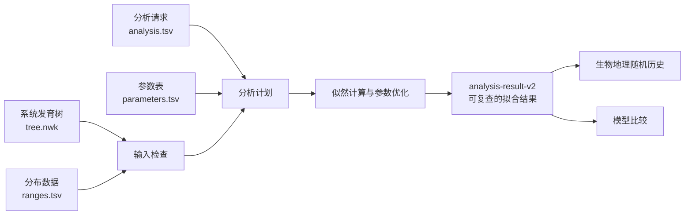
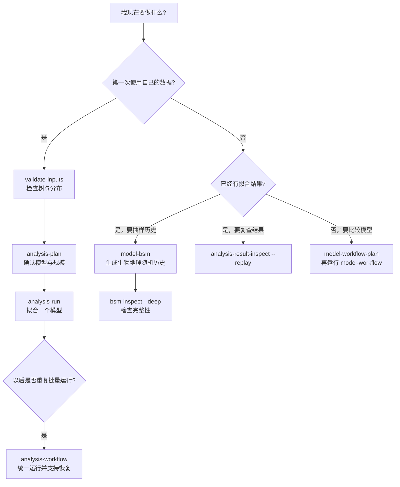

# biogeo-rs 命令行完整教程

这份教程面向第一次使用 biogeo-rs、也不熟悉最大似然生物地理分析的用户。它不重复安装过程；如果软件还没有安装，请先阅读 [安装教程](installation.md)。

学完以后，你应该能够：

- 检查树和分布数据能否用于分析；
- 运行 DEC 并判断参数优化是否正常完成；
- 读懂主要似然值、参数和祖先范围结果；
- 生成并检查生物地理随机历史；
- 比较 DEC、DEC+J、DIVALIKE、DIVALIKE+J、BAYAREALIKE 和 BAYAREALIKE+J；
- 为自己的数据准备分析文件；
- 运行时间分层、化石和不确定分布等进阶分析。

本教程的 PowerShell 命令默认从仓库根目录运行。Linux 用户把 `biogeo-cli.exe` 改成 `biogeo-cli`，并使用 Linux 路径格式即可。

## 1. 先理解一次分析包含什么

一次常规分析至少需要两份生物学输入：

1. 一棵带枝长的系统发育树；
2. 每个末端类群在哪些区域分布的数据。

此外还需要一份分析请求，说明使用什么模型、最大范围大小、根部先验和参数设置等。biogeo-rs 会先检查这些文件，再拟合模型并写出结果。



这里有两个重要区别：

- **拟合模型**回答哪些参数最能解释当前树和分布数据，以及各祖先节点可能有哪些范围。
- **生物地理随机历史**在已经拟合的模型条件下，抽样可能发生过的扩散、局部灭绝和节点分裂历史。它不是重新拟合模型。

## 2. 准备命令行

先编译发布版本：

```powershell
cargo build --release
```

为了避免在每条命令里重复写较长的程序路径，可以在当前 PowerShell 窗口设置：

```powershell
$BioGeo = (Resolve-Path .\target\release\biogeo-cli.exe).Path
```

确认程序可以运行：

```powershell
& $BioGeo --help
```

`$BioGeo` 只在当前 PowerShell 窗口有效。重新打开终端后，再执行一次赋值命令即可。

## 3. 第一课：用仓库示例完成一次 DEC 分析

仓库中的 `examples/analysis_request` 是适合入门的完整分析。它已经包含树、分布数据、分析请求和参数表。

### 3.1 先检查输入

```powershell
& $BioGeo validate-inputs `
  --tree examples\analysis_request\tree.nwk `
  --ranges examples\analysis_request\ranges.tsv
```

这一步主要检查：

- 树能否解析；
- 树中的末端名称和分布表中的名称是否对应；
- 区域列和范围编码是否合法；
- 是否存在明显阻止分析的问题。

不要跳过输入检查。名称中多一个空格、树和分布表使用不同简称，都会使后续结果失去意义或直接停止运行。

### 3.2 查看分析计划

```powershell
& $BioGeo analysis-plan `
  --request examples\analysis_request\analysis.tsv
```

分析计划不会拟合模型。它会把请求解析为一份容易检查的摘要。重点看这些字段：

| 字段 | 含义 | 应该检查什么 |
| --- | --- | --- |
| `status` | 请求是否可运行 | 应为 `valid` |
| `tips` | 树的末端数 | 是否符合数据集预期 |
| `areas` | 区域数 | 是否符合分布表列数 |
| `states` 或 `state_count_estimate` | 允许的地理范围状态数 | 是否因区域数和最大范围过大而异常膨胀 |
| `free_parameters` | 需要优化的参数 | DEC 入门示例应包含 `d` 和 `e` |
| `risk_level` | 资源风险提示 | 高风险时先确认模型配置和机器资源 |

计划中的资源提示不是生物学结论，也不会自动改变模型。它只是让用户在正式计算前知道任务大概有多大。

### 3.3 运行分析

下面把结果写入 `runs/tutorial-dec`：

```powershell
& $BioGeo analysis-run `
  --request examples\analysis_request\analysis.tsv `
  --output-dir runs\tutorial-dec
```

结果目录不会默默覆盖已有分析。如果目录已经存在，请换一个新目录，或在确认不再需要旧结果后自行处理旧目录。

### 3.4 检查结果并重放似然

```powershell
& $BioGeo analysis-result-inspect `
  --analysis-result runs\tutorial-dec `
  --replay
```

`--replay` 会根据保存下来的输入和参数重新计算一次似然。它用于确认结果包没有缺文件、参数没有被误改，且当前程序能够复现该结果。

结果检查时先看：

- `status=complete`：结果目录已完整写出；
- `optimization_converged`：参数优化是否满足收敛条件；
- `ln_likelihood`：当前模型在这份数据上的对数似然；
- 最终的 `d`、`e` 等参数；
- 重放所得似然是否与保存结果一致。

注意，`status=complete` 只表示程序正常完成并发布了结果，不能代替 `optimization_converged`。如果优化没有收敛，结果可以用于诊断，但不应直接当作最终生物学结论。

### 3.5 结果目录中有什么

`analysis-result-v2` 结果包通常包含：

| 文件或目录 | 用途 |
| --- | --- |
| `metadata.tsv` | 模型、似然、优化状态和结果格式版本等摘要 |
| `source-parameters.tsv` | 用户提交的原始参数表 |
| `resolved-parameters.tsv` | 固定、联动和派生关系解析后的实际参数 |
| `inputs.tsv` | 输入文件清单和校验信息 |
| `input-bundle/` | 可复查、可迁移的输入副本 |
| 祖先范围结果 | 各内部节点的范围概率 |
| 分裂结果 | 各节点分裂情景的条件概率 |

具体文件名可能随着结果格式版本扩展。读取结果时优先使用 `metadata.tsv` 中声明的格式版本，不要只依赖文件出现的顺序。完整格式说明见 [分析结果目录](analysis-result.md)。

## 4. 第二课：理解 DEC 到底优化了什么

DEC 中最常见的两个沿枝参数是：

- `d`：范围扩张或扩散速率；
- `e`：局部灭绝或范围收缩速率。

参数优化不是把结果“调成和 BioGeoBEARS 一样”。它是在给定树、分布数据、状态空间和模型规则后，寻找使数据似然最大的参数值。

可以把过程粗略理解为：

1. 先尝试一组 `d` 和 `e`；
2. 计算这组参数产生现有末端分布的可能性；
3. 再尝试更合适的参数；
4. 直到继续调整已经不能明显提高似然。

BioGeoBEARS 对照测试的目的，是确认两套实现对同一数学模型给出一致或可解释的结果；实际分析中的参数仍由用户数据决定。

### 4.1 `fixed`、`free` 和 `derived`

参数表中的状态决定参数怎样进入模型：

| 状态 | 含义 | 示例 |
| --- | --- | --- |
| `fixed` | 固定为指定值，不参加优化 | DEC 中通常固定 `j=0` |
| `free` | 由优化器估计 | DEC 中通常释放 `d`、`e` |
| `derived` | 由其他参数或联动关系计算 | `y/s/v` 权重可由统一规则解析 |

不要为了得到某个期望结果随意修改参数状态。改变自由参数、状态空间或分裂规则，等于改变被拟合的模型。

### 4.2 常见参数分组

| 参数 | 所控制的过程 |
| --- | --- |
| `d`, `e` | 沿枝扩散和局部灭绝 |
| `x`, `n`, `u` | 距离、面积或环境等沿枝修饰效应 |
| `y`, `s`, `v`, `j` | 节点上的范围复制、子集同域、隔离分化和奠基者事件权重 |
| `mx01*` | 节点分裂时较小子范围大小的形状控制 |

详细规则见 [参数表](parameter-table.md)。如果只是进行标准六模型比较，优先使用已经提供的 preset 参数表，不必从空白表手写所有关系。

## 5. 第三课：为自己的数据创建 DEC 分析

### 5.1 生成模板

```powershell
& $BioGeo analysis-template `
  --preset dec `
  --mode optimize `
  --output-dir my-analysis
```

模板会生成：

- `my-analysis/analysis.tsv`；
- `my-analysis/parameters.tsv`。

此时模板尚不可运行，因为还没有你的树和分布数据。把它们放入该目录并命名为 `tree.nwk` 和 `ranges.tsv`，或修改 `analysis.tsv` 中的相对路径。

### 5.2 树文件

最简单的输入是带枝长的 Newick：

```text
((taxon_a:1.2,taxon_b:1.2):0.8,taxon_c:2.0);
```

biogeo-rs 也支持常见的 NEXUS 树、引号标签、标签中的空格以及相关输入边界。仍建议在正式运行前执行 `validate-inputs`，因为不同软件导出的注释格式可能不同。

枝长代表模型演化过程经历的时间尺度。缺失枝长不能在没有明确生物学依据时随意补成一个固定值；如需处理缺失枝长，应先确认数据来源和分析假设。

### 5.3 分布表

常规 `ranges.tsv` 的思路是第一列为类群名，后续每列为一个区域，使用 0/1 表示是否分布。例如：

```text
tip\tA\tB\tC
taxon_a\t1\t0\t0
taxon_b\t1\t1\t0
taxon_c\t0\t0\t1
```

上面的 `\t` 表示制表符。实际文件应为 TSV，不要把两个字符 `\` 和 `t` 原样写进去。首列表头使用 `tip`，下面填写与树末端完全一致的名称。

最重要的规则是：

- 每个树末端必须能在分布数据中找到；
- 名称大小写、空格和标点应完全一致；
- 区域列含义在整个分析中保持一致；
- 不确定信息不要擅自改成确定的 0 或 1。

如果已有 BioGeoBEARS `.data`、CSV 或其他支持格式，可以使用项目提供的转换命令。转换后仍要执行输入检查，确认类群数、区域数和范围没有变化。命令总览见 [命令行参考](command-line-help.md)。

### 5.4 设置最大范围大小

`max_range_size` 表示一个祖先或末端状态最多允许包含多少个区域。它既是生物学假设，也决定计算规模。

假设有 `A` 个区域，允许的非空范围大小不超过 `K`，状态数为：

```text
C(A,1) + C(A,2) + ... + C(A,K)
```

如果允许空范围，再加 1。例如 7 个区域、最大范围为 5：

```text
7 + 21 + 35 + 35 + 21 = 119
```

允许空范围时为 120 个状态。区域数增加后，状态数可能迅速增长，所以不能只根据电脑内存盲目把 `max_range_size` 设到最大。它应符合研究对象可能占据的最大范围，并通过 `analysis-plan` 查看实际规模。

`max_states` 是可选的资源保护设置，不是模型参数。未设置时，软件不会暗中替你固定一个生物学上限。

### 5.5 检查并运行自己的分析

```powershell
& $BioGeo validate-inputs `
  --tree my-analysis\tree.nwk `
  --ranges my-analysis\ranges.tsv

& $BioGeo analysis-plan `
  --request my-analysis\analysis.tsv

& $BioGeo analysis-run `
  --request my-analysis\analysis.tsv `
  --output-dir runs\my-dec
```

建议始终按“检查输入、查看计划、正式运行”这三个步骤操作。这样出现错误时，更容易判断问题来自数据、模型配置还是计算过程。

## 6. 第四课：生成生物地理随机历史

完成模型拟合后，可以从结果包生成生物地理随机历史：

```powershell
& $BioGeo model-bsm `
  --analysis-result runs\tutorial-dec `
  --bsm-samples 100 `
  --bsm-output-dir runs\tutorial-dec-bsm `
  --bsm-output-level compact `
  --bsm-threads auto `
  --bsm-shard-samples 25 `
  --seed 20260828
```

这里的关键参数是：

| 参数 | 含义 |
| --- | --- |
| `--bsm-samples 100` | 抽样 100 条可能的历史 |
| `--bsm-output-level compact` | 保存路径细节，但使用适合大任务的稀疏结果 |
| `--bsm-threads auto` | 使用当前进程实际可用的并行度 |
| `--bsm-shard-samples 25` | 每 25 条历史写入一个分片 |
| `--seed` | 主随机种子，用于复现抽样 |

### 6.1 为什么需要很多次抽样

单条生物地理随机历史只是符合模型和数据的一种可能历史，不能代表完整的不确定性。多次抽样后，才可以比较：

- 扩散和局部灭绝事件数量的分布；
- 不同节点分裂事件类型所占比例；
- 各时期发生事件的比例；
- 各地理范围被占据的时间分布。

可以先用 10 到 100 条检查流程和输出，再逐步增加样本，并观察主要汇总量是否稳定。不存在适用于所有研究的固定样本数。

### 6.2 输出等级怎样选择

| 等级 | 路径细节 | 占据结果 | 适用场景 |
| --- | --- | --- | --- |
| `legacy` | 保留 | 稠密 | 兼容旧脚本 |
| `full` | 保留 | 稠密 | 人工检查或完整归档 |
| `compact` | 保留 | 稀疏 | 新分析、大样本任务、后续接入 RASP |
| `summary` | 不保留 | 稀疏汇总 | 只关心分布统计、尽量减少磁盘占用 |

如果后续需要逐条历史或路径事件，不要选择 `summary`。常规新任务优先使用 `compact`。

### 6.3 深度检查 BSM 结果

```powershell
& $BioGeo bsm-inspect `
  --bsm-result runs\tutorial-dec-bsm `
  --deep
```

`--deep` 会读取所有结果行，检查事件链、时间顺序、占据时长、时期约束和分片完整性。它比只看文件是否存在更严格，适合正式归档前使用。

在相同模型、输入、参数和主随机种子下，每个样本由其样本编号独立派生随机流。因此把线程数从 4 改成 16，不应改变第 37 条历史本身；线程调度只影响完成顺序和速度。

## 7. 第五课：比较六个常用模型

biogeo-rs 的核心是统一似然框架。常用模型不是六套互不相关的算法，而是同一套状态空间、沿枝过程、节点分裂过程和似然引擎的不同参数配置。

| preset | 主要区别 |
| --- | --- |
| DEC | DEC 的沿枝与节点分裂规则，`j=0` |
| DEC+J | 在 DEC 基础上释放奠基者事件参数 `j` |
| DIVALIKE | 使用更接近 DIVA 的节点分裂权重和拆分规则 |
| DIVALIKE+J | DIVALIKE 加 `j` |
| BAYAREALIKE | 使用更接近 BayArea-like 的范围复制和沿枝变化配置 |
| BAYAREALIKE+J | BAYAREALIKE 加 `j` |

仓库提供了一个 DEC 与 DEC+J 的完整模型工作流示例。先查看计划：

```powershell
& $BioGeo model-workflow-plan `
  --request examples\model_workflow\workflow.tsv
```

再运行：

```powershell
& $BioGeo model-workflow `
  --request examples\model_workflow\workflow.tsv `
  --output-dir runs\tutorial-models
```

工作流会逐个拟合模型，生成比较表，并按照请求指定的模型生成生物地理随机历史。主要结果位于：

- `runs/tutorial-models/model-batch/comparison.tsv`；
- 各模型自己的 `analysis-result-v2` 结果目录；
- 模型平均的祖先范围结果；
- 被选中模型的生物地理随机历史结果。

### 7.1 怎样读模型比较

在相同树、分布数据、状态空间和似然定义下：

- `lnL` 越大，也就是越接近 0，模型对数据的拟合越好；
- AIC 同时考虑拟合与自由参数数量，越小越好；
- `delta AIC` 是某模型与最低 AIC 的差；
- Akaike weight 表示模型在候选集合中的相对支持度。

不能直接比较使用不同数据、不同允许范围、不同根先验或不同似然定义所得的 lnL/AIC。

似然比检验只适用于满足嵌套关系和统计条件的模型。特别是参数位于边界时，不能机械地套普通卡方近似。软件会判断已知的嵌套关系，但研究解释仍应说明比较条件。

模型平均可用于汇总祖先范围等条件结果，但一条生物地理随机历史必须来自一套具体的转移率和节点分裂概率。因此 BSM 要明确选用一个已经拟合的模型，不能从“平均模型”中凭空抽取路径。

### 7.2 扩展为六模型

仓库已经提供六个 preset 的清单，可以直接在官方来源的 Psychotria 时间分层数据上运行：

```powershell
& $BioGeo model-batch `
  --manifest examples\model_batch\psychotria-six-models.tsv `
  --output-dir runs\tutorial-six-models `
  --tree examples\stratified_analysis\tree.nwk `
  --ranges examples\stratified_analysis\ranges.tsv `
  --max-range-size 4 `
  --include-null-range `
  --root-prior flat `
  --dispersal-strata examples\stratified_analysis\anagenetic_strata.tsv `
  --max-iterations 500
```

完成后读取 `runs/tutorial-six-models/comparison.tsv`。六个模型各自的可重放结果位于 `runs/tutorial-six-models/models/`。这个示例会同时给出 AIC/AICc、权重、已知嵌套关系，以及三个无 `+J` 模型与对应 `+J` 模型的似然比检验。

换成自己的数据时，六模型批量分析的做法是：

1. 为每个 preset 准备对应参数表；
2. 在模型清单中给每个模型设置唯一 `model_id` 和参数表路径；
3. 让所有模型共用同一份树、分布数据和状态空间配置；
4. 先运行 `model-workflow-plan` 检查；
5. 再正式运行并阅读 `comparison.tsv`。

不要在比较中让某个模型使用不同 `max_range_size`，除非研究问题明确需要这样做，并且你理解这会改变状态空间和比较含义。

## 8. 第六课：用一个命令完成拟合和 BSM

熟悉分步命令后，可以使用一体化工作流：

```powershell
& $BioGeo analysis-workflow `
  --request examples\analysis_request\analysis.tsv `
  --output-dir runs\tutorial-workflow `
  --bsm-samples 100 `
  --bsm-output-level compact `
  --bsm-threads auto `
  --deep
```

这条命令会依次完成：

1. 解析并检查分析请求；
2. 拟合模型；
3. 生成指定数量的生物地理随机历史；
4. 深度检查输出；
5. 写出工作流清单和状态。

中断后，可以对同一输出目录执行：

```powershell
& $BioGeo analysis-workflow `
  --request examples\analysis_request\analysis.tsv `
  --output-dir runs\tutorial-workflow `
  --bsm-samples 100 `
  --bsm-output-level compact `
  --bsm-threads auto `
  --deep `
  --resume
```

恢复运行要求分析请求和科学配置保持一致。不要修改参数表后继续复用旧工作流目录，否则新旧结果在科学意义上已经不是同一任务。

## 9. 第七课：时间分层分析

不同地质时期的区域连通性、距离或面积可能不同。时间分层分析允许沿树枝按时间区间使用不同修饰矩阵。

仓库内的 `examples/stratified_analysis` 是由 BioGeoBEARS 官方 Psychotria M4b 案例整理而来的 19 末端、4 区域对照示例。

先查看计划：

```powershell
& $BioGeo analysis-plan `
  --request examples\stratified_analysis\analysis.tsv
```

再运行：

```powershell
& $BioGeo analysis-run `
  --request examples\stratified_analysis\analysis.tsv `
  --output-dir runs\tutorial-stratified
```

检查和重放：

```powershell
& $BioGeo analysis-result-inspect `
  --analysis-result runs\tutorial-stratified `
  --replay
```

这个示例的 `anagenetic_strata.tsv` 使用 `oldest_age` 指定每个时期的年龄上界，并引用该时期的扩散倍数、距离和面积文件。软件会在一条跨越多个时期的枝上按边界分段计算。

时间边界必须覆盖树的实际年龄范围；区域顺序必须在所有矩阵中一致。邻接、距离、面积和环境修饰代表不同生物学假设，不应只为了获得更高似然而全部释放。

## 10. 进阶输入

### 10.1 不确定分布

0/1 表示确定缺失或存在；`?` 可用于声明不确定信息。模糊观测不应在预处理时强行选成一个确切范围。biogeo-rs 会按观测模型对与证据相容的真实状态求和。

使用不确定分布时，要在方法中说明不确定性的来源和编码规则，并保留原始表。详细格式见 [不确定分布](ambiguous-ranges.md)。

### 10.2 检测模型

当某区域的未记录可能来自检测不完全，而不是真实缺失时，可以使用检测相关参数，例如 `mf`、`dp` 和 `fdp`。这类分析把“真实范围”和“观测结果”区分开来。

只有在数据确实包含检测过程信息或有合理外部约束时，才应释放这些参数。没有信息的数据无法凭空同时精确估计所有观测和生物地理参数。详细说明见 [检测模型](detection-model.md)。

### 10.3 化石、非现生末端和直接祖先

化石类群可以带有采样年龄或年龄区间。随机化石放置可以受 stem/crown 和类群约束控制。超短枝不能自动等同于直接祖先；直接祖先是树结构和采样语义，不只是一个很小的枝长。

对于这类数据，应先确认：

- 年龄区间是否合法；
- 化石年龄是否落在允许的枝段；
- stem/crown 约束是否对应预期类群；
- 直接祖先关系是否由输入明确表达；
- 随机放置使用的种子和重复次数是否已记录。

相关格式见 [树输入与化石末端](tree-input-and-fossil-tips.md) 和 [随机化石放置](random-fossil-placement.md)。

## 11. 选择命令的简单方法



一句话记忆：

- 不确定输入是否正确：`validate-inputs`；
- 不确定任务有多大、参数是否合理：`analysis-plan`；
- 拟合单个模型：`analysis-run`；
- 复查拟合结果：`analysis-result-inspect --replay`；
- 生成生物地理随机历史：`model-bsm`；
- 检查 BSM：`bsm-inspect --deep`；
- 比较多个模型：`model-workflow`；
- 批量完成整套分析：`analysis-workflow`。

## 12. 常见问题

| 现象 | 常见原因 | 处理方法 |
| --- | --- | --- |
| 找不到程序 | 尚未编译，或 `$BioGeo` 路径失效 | 执行 `cargo build --release` 并重新设置 `$BioGeo` |
| 树与分布表类群不一致 | 名称、大小写、空格或简称不同 | 用 `validate-inputs` 查看缺失和多余名称 |
| 状态数非常大 | 区域数或 `max_range_size` 过大 | 检查生物学假设并先看 `analysis-plan` |
| 优化完成但未收敛 | 初始值、容差、迭代上限或参数可识别性问题 | 检查轨迹，尝试合理初始值；不要只看 `status=complete` |
| 两次 BSM 逐条结果不同 | 种子、模型结果或科学配置不同 | 固定主种子并保留结果清单 |
| BSM 文件过大 | 使用 `full/legacy` 或样本过多 | 新任务优先用 `compact`，只需汇总时用 `summary` |
| lnL 与另一分析不同 | 数据、状态空间、根先验、参数或似然定义不同 | 先逐项确认比较条件，不要只比较一个数字 |
| 输出目录已存在 | 软件避免覆盖已有科研结果 | 使用新目录；确认后再自行归档或清理旧目录 |

## 13. 正式分析前的检查清单

### 输入

- 树和分布表的类群一一对应；
- 枝长和时间单位有明确来源；
- 区域顺序在所有文件中一致；
- `max_range_size` 有生物学依据；
- 不确定分布、化石和直接祖先没有被错误简化。

### 模型

- 明确记录 preset 和参数表；
- 明确哪些参数固定、释放或联动；
- 比较模型时使用相同数据和状态空间；
- 没有仅为提高拟合而无依据地增加修饰参数。

### 计算结果

- `analysis-plan` 为有效；
- 优化达到收敛，或清楚记录未收敛原因；
- 结果通过 `analysis-result-inspect --replay`；
- BSM 结果通过 `bsm-inspect --deep`；
- 保存程序版本、随机种子、分析请求和输入包。

### 论文或共享材料

- 报告软件版本和结果格式版本；
- 报告模型、自由参数、状态空间和根先验；
- 报告时间分层和修饰矩阵来源；
- 报告生物地理随机历史样本数和汇总方法；
- 不只保存截图，应保存可重放的结果目录。

## 14. 下一步阅读

- [安装教程](installation.md)：Windows、Linux 和源码安装。
- [命令行参考](command-line-help.md)：全部命令和参数入口。
- [分析请求格式](analysis-request.md)：`analysis.tsv` 的字段说明。
- [分析工作流](analysis-workflow.md)：运行、恢复和工作流结果。
- [模型工作流](model-workflow.md)：批量拟合、模型比较和模型平均。
- [BSM 检查](bsm-inspection.md)：生物地理随机历史结果和深度校验。
- [BioGeoBEARS 中文教程](biogeobears-chinese-tutorial.md)：理论背景、BioGeoBEARS 术语和 R 端参考流程。
- [与 RASP 对接](rasp-cli-integration.md)：稳定命令行接口和结果格式。

建议先完整运行第 3 节的 DEC 示例，再用第 5 节模板替换为自己的小数据。确认输入、优化和结果解读都正确后，再进入六模型、时间分层和大规模生物地理随机历史分析。
